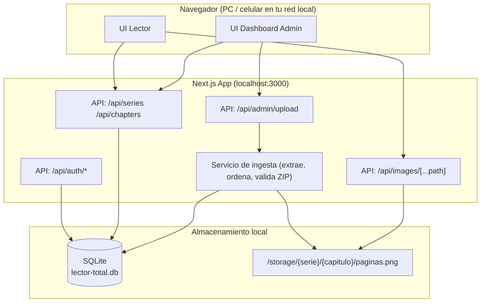

# 2. Arquitectura

## 2.1 Stack técnico

| Capa | Tecnología | Por qué |
|---|---|---|
| Frontend + Backend | **Next.js 15** (App Router, TypeScript) | Un solo proyecto sirve UI y API, ideal para un proyecto personal sin infraestructura separada |
| Estilos | **Tailwind CSS** | Rápido de armar UI de lector/dashboard sin escribir CSS a mano |
| Base de datos | **SQLite** vía **Prisma ORM** | Cero configuración, un solo archivo `.db`, fácil de respaldar (copiar y pegar el archivo) |
| Autenticación | Sesiones por cookie firmada (`iron-session` o similar) + `bcrypt` para hashear contraseñas | No hace falta OAuth/email; login simple apodo+contraseña |
| Extracción de ZIP | `adm-zip` (Node) | Extrae los `.zip` que exporta Koharu |
| Miniaturas | `sharp` | Solo para generar portadas pequeñas; **nunca** toca las páginas originales |
| Servido de imágenes | Ruta de API propia (stream directo del archivo) | Control total: sin recompresión, con headers de cache, protegido por sesión |

## 2.2 Diagrama de componentes



## 2.3 Estructura de carpetas (real)

```
D:\Pagina Web mangastotal\
├── docs/                      # esta documentación
├── prisma/
│   ├── schema.prisma          # definición de la base de datos
│   └── migrations/            # migraciones aplicadas
├── src/
│   ├── middleware.ts          # protege rutas; define cuáles son públicas
│   ├── app/
│   │   ├── (reader)/          # biblioteca, serie/[slug], perfil (con header)
│   │   ├── (admin)/admin/     # dashboard, subir, series, noticias, usuarios
│   │   ├── leer/[chapterId]/  # lector inmersivo (sin header de navegación)
│   │   ├── login/
│   │   ├── registro/
│   │   └── api/
│   │       ├── auth/          # register, login, logout, me, avatar, password
│   │       ├── series/        # lista/CRUD + [slug]/chapters
│   │       ├── chapters/[id]/ # borrar + /pages
│   │       ├── announcements/ # noticias (GET público, resto admin)
│   │       ├── progress/      # marcador + /continue
│   │       ├── favorites/
│   │       ├── admin/upload/  # ingesta + historial + [jobId] polling
│   │       ├── admin/users/
│   │       └── images/[...path]/  # stream directo desde storage/
│   ├── components/
│   │   ├── reader/            # Reader, CascadeReader, RtlReader, FullscreenToggle
│   │   ├── library/           # SeriesCard, FavoriteButton
│   │   ├── dashboard/         # JobsTable
│   │   └── ui/                # AuthCard, LogoutButton
│   └── lib/
│       ├── db.ts              # cliente Prisma
│       ├── auth.ts            # sesión iron-session + helpers
│       ├── ingest.ts          # pipeline de extracción/orden de ZIP
│       ├── storage.ts         # raíz de storage + rutas seguras + content types
│       └── slug.ts            # slugify y nombres de carpeta
├── storage/                   # NO se sube a git — biblioteca real (png)
│   ├── {series-slug}/cover.jpg           # miniatura de portada (sharp)
│   ├── {series-slug}/{nro-cap}/0001.png  # páginas byte a byte
│   └── avatars/u{id}-{timestamp}.webp    # fotos de perfil
├── lector-total.db            # NO se sube a git — base de datos SQLite
├── .env                       # DATABASE_URL (la lee Prisma CLI)
├── .env.local                 # SESSION_SECRET
└── package.json
```

## 2.4 Por qué SQLite y no Postgres/MySQL

Para un solo usuario (o un puñado de personas en tu red local), un motor
de base de datos cliente-servidor es sobre-ingeniería: más procesos
corriendo, más configuración, más superficie de fallos. SQLite:

- Es un solo archivo — el respaldo es literalmente copiar `lector-total.db`.
- Prisma lo trata igual que a cualquier otra base — si el día de mañana
  esto crece y necesitás Postgres, migrar el `schema.prisma` es directo.
- Soporta perfectamente la carga de uso personal (miles de páginas, pocos
  usuarios concurrentes).

## 2.5 Seguridad (para uso privado, no para producción pública)

- **Rutas públicas (modo visitante)**: `/biblioteca`, `/serie/[slug]`, `/login`,
  `/registro`, y las APIs de solo lectura que las alimentan (`GET /api/series*`,
  `GET /api/announcements`, `GET /api/images/*` para portadas). Un visitante
  solo ve contenido de la sección Normal.
- **Rutas con sesión**: leer capítulos (`/leer/*`), perfil, progreso, favoritos.
- **Rutas de admin**: `/admin/*` y `/api/admin/*` exigen `is_admin` (el
  middleware redirige o responde 403).
- **Excepción del middleware**: las rutas de subida de archivos
  (`/api/admin/upload` y `/api/auth/avatar`) están excluidas del matcher del
  middleware, porque cuando una petición pasa por el middleware Next.js corta
  el body en 10 MB y los `.zip` grandes llegarían truncados. Esas rutas validan
  sesión/admin por su propia cuenta — la protección se mantiene.
- Contraseñas con `bcrypt` (nunca texto plano). Cambio de contraseña desde el
  perfil verificando la actual.
- El servidor escucha en `127.0.0.1` por defecto; si querés acceder desde
  el celular en la misma red, se cambia a `0.0.0.0` **manualmente** y sigue
  sin ser accesible desde internet salvo que reenvíes puertos en tu router
  (cosa que esta documentación no cubre ni recomienda).
- Sin claves de API externas, sin telemetría, sin servicios de terceros.
