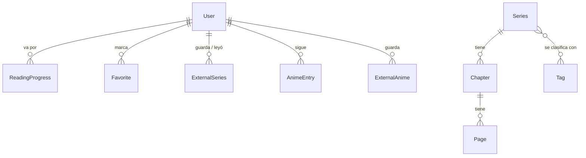

# 3. Base de datos

**Postgres en Neon**, con Prisma 6. El esquema está en
`prisma/schema.prisma` y las migraciones en `prisma/migrations/`.

> Documentación vieja habla de SQLite. Ya no: Vercel no guarda archivos entre
> peticiones, así que un `.db` en disco se pierde. El archivo
> `lector-total.db` que queda en la raíz es del proyecto original y no se usa.

## 3.1 Cómo se relacionan



Hay tres mundos que **no se cruzan en la base**:

- **Catálogo propio**: `Series → Chapter → Page`, con el progreso en
  `ReadingProgress`.
- **Lecturas externas**: todo en una sola tabla, `ExternalSeries`. No hay
  capítulos ni páginas guardadas: se piden al sitio de origen cada vez.
- **Anime externo**: referencias guardadas en `ExternalAnime`; las fichas,
  episodios y el reproductor siguen viniendo de cada proveedor.

## 3.2 Los modelos

### `User`
Cuenta. Lo que importa fuera de lo obvio:

- `showAdultContent` — si es `false`, nunca se le muestra contenido +18. Un
  visitante sin sesión cuenta como `false`.
- `animeEnabled` — activa la sección animada, que viene oculta y apagada para
  cada cuenta. No reemplaza ni implica `showAdultContent`.
- `preferredReadingMode` — `cascade` (webtoon, scroll vertical) o `rtl`
  (manga, página por página de derecha a izquierda).
- `isAdmin` — habilita `/admin` y las rutas `/api/admin/*`.

### `Series`, `Chapter`, `Page`
El catálogo propio, lo que sube el administrador.

- `Series.type` — `normal` o `adult`. Es el filtro de +18.
- `Series.slug` — único; es lo que va en la URL.
- `Page.filePath` — dónde quedó la imagen, según `STORAGE_PROVIDER`.
- `Page.width` / `height` — se guardan al subir. El lector los usa para
  reservarle el hueco exacto a cada página antes de que cargue.

### `ExternalSeries` — el modelo con más trampa
Una fila por (usuario, fuente, serie). Guarda **una referencia**, nunca
contenido.

| Campo | Para qué |
|---|---|
| `source` | `mangadex`, `olympus`, `tmo`, `ikigai`, `leercapitulo`, `catharsis` |
| `externalId` | El identificador de esa serie **en su sitio** |
| `lastChapterId` / `lastChapterName` | Por qué capítulo va |
| `lastPageNumber` | Y por qué página dentro de ese capítulo |
| `saved` | **`true` = biblioteca, `false` = historial** |

Dos cosas que hay que saber:

**`saved` separa biblioteca de historial.** Son las mismas filas. Cuando
alguien abre un capítulo de una serie que no tenía guardada, se crea la fila
con `saved: false` y aparece en Historial. Si después la guarda, la misma
fila pasa a `saved: true` y se mueve a la biblioteca **sin perder por dónde
iba**. Por eso son una tabla y no dos.

**`externalId` no siempre es un id suelto.** Algunas fuentes necesitan más de
un dato para armar la URL, y se guardan juntos separados por `/`:

- ZonaTMO: `tipo/id/slug`
- LeerCapítulo: `id/slug`
- El resto: el id a secas

Quien arma las URLs a partir de eso es `src/lib/externas.ts`
(`fichaHref` y `capituloHref`). **Si agregás una fuente, va ahí**, no en cada
página.

### `AnimeEntry`
Seguimiento de anime contra AniList. `anilistId` es el id de allá. **No hay
video**: solo cuántos episodios lleva vistos.

### `ExternalAnime`
Anime reproducible guardado desde fuentes externas. Conserva la fuente, su
identificador, el slug y metadatos de la ficha; nunca direcciones de video.
Está separado de `AnimeEntry` para que AnimeList y Anime animado no mezclen
conceptos. Las rutas internas se arman en `src/lib/animeExternos.ts`.

### `Tag`, `Favorite`, `Announcement`, `IngestionJob`
Categorías del catálogo propio, favoritos, las noticias que publica el
administrador, y el registro de cada `.zip` subido (con su estado y el error
si falló).

## 3.3 Migraciones

En Vercel corren **solas** en cada deploy, porque `vercel-build` es:

```
prisma generate && prisma migrate deploy && next build
```

Esto significa dos cosas importantes:

1. **Un cambio de esquema se aplica al hacer push.** No hay paso manual.
2. **Una migración rota tumba el deploy entero**, no solo la parte nueva.

Para crear una migración:

```bash
npx prisma migrate dev --name algo_descriptivo
```

Y revisar el `.sql` que genera antes de subirlo. Nunca editar una migración
que ya se aplicó en producción: crear una nueva.
