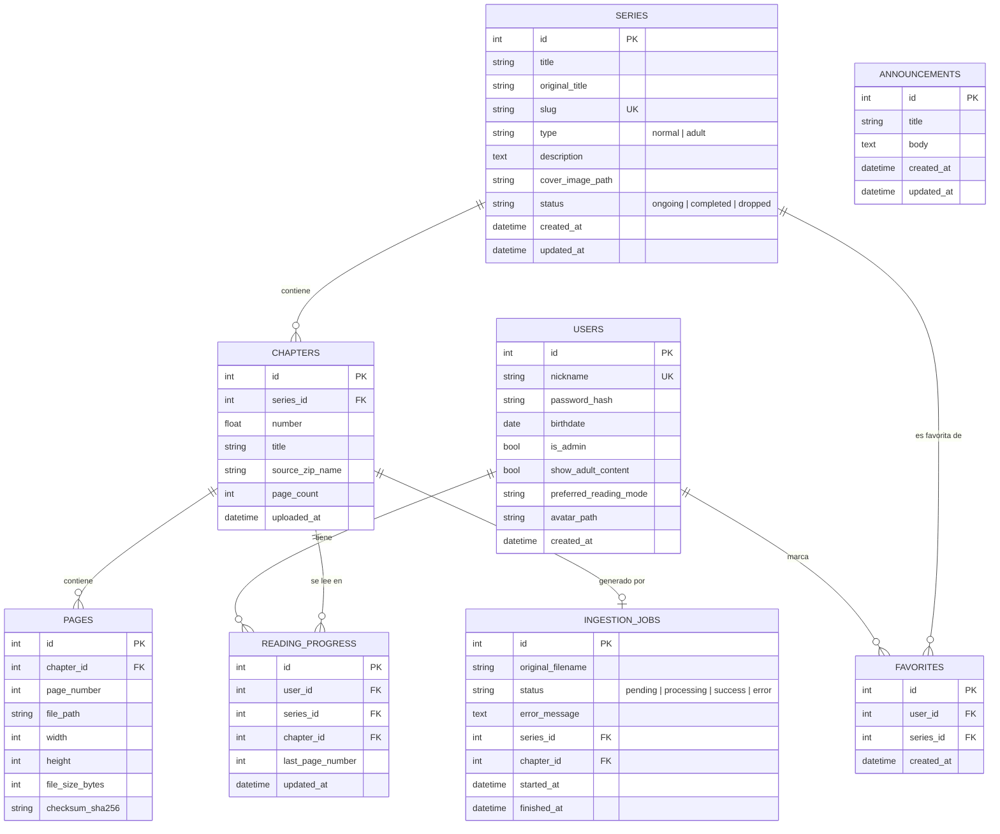

# 3. Base de datos

## 3.1 Diagrama entidad-relación

## 3.2 Detalle de tablas

### `users`

| Columna | Tipo | Notas |
|---|---|---|
| id | INTEGER PK | autoincremental |
| nickname | TEXT UNIQUE | usado para login, sin espacios |
| password_hash | TEXT | bcrypt, nunca se guarda en texto plano |
| birthdate | DATE (nullable) | dato personal/preferencia, no gate legal |
| is_admin | BOOLEAN | default `false`; solo vos deberías tener `true` |
| show_adult_content | BOOLEAN | default `false`; filtro de biblioteca, editable en tu perfil. Al registrarse se precarga según la edad (≥18) |
| preferred_reading_mode | TEXT | `cascade` \| `rtl`, se recuerda como preferencia |
| avatar_path | TEXT (nullable) | ruta relativa en `storage/avatars/` de la foto de perfil (webp 256×256 generado con sharp) |
| created_at | DATETIME | |

> El primer usuario registrado se crea con `is_admin = true` automáticamente.

### `series`

| Columna | Tipo | Notas |
|---|---|---|
| id | INTEGER PK | |
| title | TEXT | título mostrado |
| original_title | TEXT (nullable) | título en idioma original |
| slug | TEXT UNIQUE | usado en URLs y en el nombre de carpeta de `storage/` |
| type | TEXT | `normal` \| `adult` — define en qué sección aparece |
| description | TEXT (nullable) | |
| cover_image_path | TEXT (nullable) | ruta relativa a la miniatura generada |
| status | TEXT | `ongoing` \| `completed` \| `dropped` |
| created_at / updated_at | DATETIME | |

### `chapters`

| Columna | Tipo | Notas |
|---|---|---|
| id | INTEGER PK | |
| series_id | INTEGER FK → series.id | |
| number | REAL | permite capítulos como `1`, `1.5`, `2` |
| title | TEXT (nullable) | ej: "El encuentro" |
| source_zip_name | TEXT | nombre original del `.zip` subido (trazabilidad) |
| page_count | INTEGER | cacheado para no contar `pages` cada vez |
| uploaded_at | DATETIME | |

### `pages`

| Columna | Tipo | Notas |
|---|---|---|
| id | INTEGER PK | |
| chapter_id | INTEGER FK → chapters.id | |
| page_number | INTEGER | orden dentro del capítulo (1, 2, 3…) |
| file_path | TEXT | ruta relativa dentro de `storage/` |
| width / height | INTEGER | dimensiones en px, calculadas al ingerir |
| file_size_bytes | INTEGER | para detectar archivos corruptos/truncados |
| checksum_sha256 | TEXT | detecta duplicados y verifica integridad |

### `reading_progress`

| Columna | Tipo | Notas |
|---|---|---|
| id | INTEGER PK | |
| user_id | INTEGER FK → users.id | |
| series_id | INTEGER FK → series.id | denormalizado para queries rápidas de "continuar leyendo" |
| chapter_id | INTEGER FK → chapters.id | |
| last_page_number | INTEGER | |
| updated_at | DATETIME | ordena la sección "Continuar leyendo" |

Restricción: único por (`user_id`, `series_id`) — cada usuario tiene un
solo "marcador" activo por serie (se sobrescribe al avanzar).

### `favorites`

| Columna | Tipo | Notas |
|---|---|---|
| id | INTEGER PK | |
| user_id | INTEGER FK | |
| series_id | INTEGER FK | |
| created_at | DATETIME | |

Único por (`user_id`, `series_id`).

### `announcements`

| Columna | Tipo | Notas |
|---|---|---|
| id | INTEGER PK | |
| title | TEXT | título del anuncio |
| body | TEXT | contenido (texto plano, respeta saltos de línea) |
| created_at / updated_at | DATETIME | ordena el feed (más reciente primero) |

Noticias/anuncios que publica el admin desde el dashboard. Se muestran en la
pestaña **Todo** de la biblioteca — es lo único que aparece ahí (los mangas
van solo a su catálogo Normal/+18).

### `ingestion_jobs`

| Columna | Tipo | Notas |
|---|---|---|
| id | INTEGER PK | |
| original_filename | TEXT | nombre del `.zip` tal cual se subió |
| status | TEXT | `pending` → `processing` → `success` \| `error` |
| error_message | TEXT (nullable) | detalle si falló (ej: "archivo corrupto", "no contiene imágenes") |
| series_id / chapter_id | INTEGER FK (nullable) | se completan cuando el job resuelve a qué serie/capítulo corresponde |
| started_at / finished_at | DATETIME | |

Esta tabla es el **historial de subidas** que ves en el dashboard —
soluciona el "¿por qué no se ven las páginas que subí?" mostrando el error
exacto en vez de fallar en silencio.

## 3.3 Índices recomendados

- `series(slug)` — único, usado en cada URL de serie.
- `series(type)` — para filtrar rápido Normal vs +18.
- `chapters(series_id, number)` — orden de capítulos dentro de una serie.
- `pages(chapter_id, page_number)` — orden de páginas dentro de un capítulo.
- `reading_progress(user_id, updated_at)` — para la sección "Continuar leyendo".
