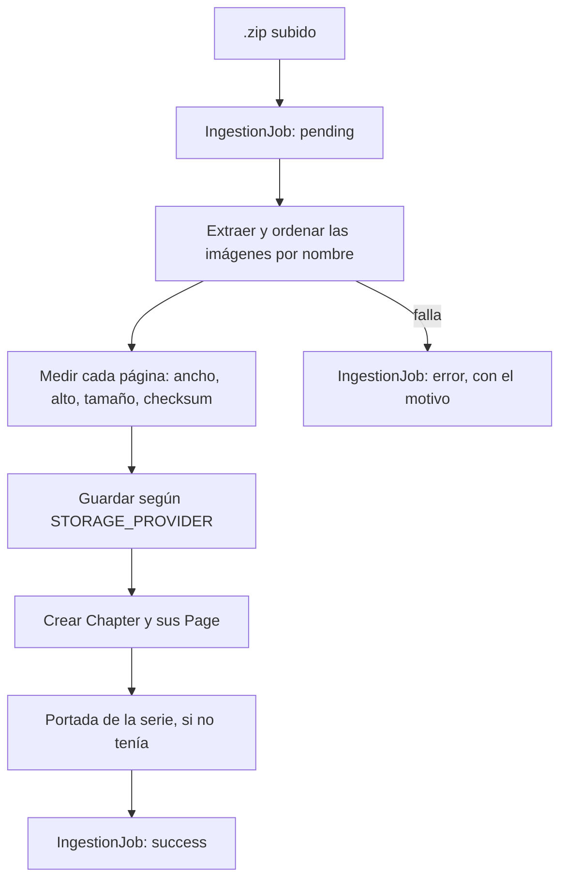

# 4. Subida de capítulos propios

Solo aplica al **catálogo propio**. Las fuentes externas no pasan por acá:
sus páginas se piden a sus servidores en el momento
([`08`](08-fuentes-externas.md)).

## 4.1 Qué entra

Un `.zip` con las imágenes de un capítulo, numeradas. Lo sube el
administrador desde `/admin/subir`.

## 4.2 El recorrido

La lógica está en `src/lib/ingest.ts`.

## 4.3 Detalles que importan

**Las páginas se ordenan por nombre de archivo.** Por eso conviene que estén
numeradas con ceros adelante (`001`, `002`…): sin eso, `10` va antes que `2`.

**Se guardan el ancho y el alto de cada página.** No es un dato decorativo:
el lector los usa para reservarle a cada página su hueco exacto antes de que
cargue, y así el scroll no salta. Es la misma información que a las fuentes
externas les falta y que causó el bug de las tiras cortadas
([`06`](06-lector.md)).

**Nunca se tocan los píxeles originales.** `sharp` se usa solo para medir y
para generar la portada.

**Cada subida queda registrada** en `IngestionJob`, con su estado y, si
falló, el motivo. Es lo que se ve en el panel.

## 4.4 Dónde quedan los archivos

Según `STORAGE_PROVIDER` ([`09`](09-despliegue-vercel.md)):

- `blob` — Vercel Blob. Es lo que se usa en producción.
- `r2` — Cloudflare R2.
- `local` — disco. Solo desarrollo: **en Vercel se pierde**.

Se sirven por `GET /api/images/[...path]`.
