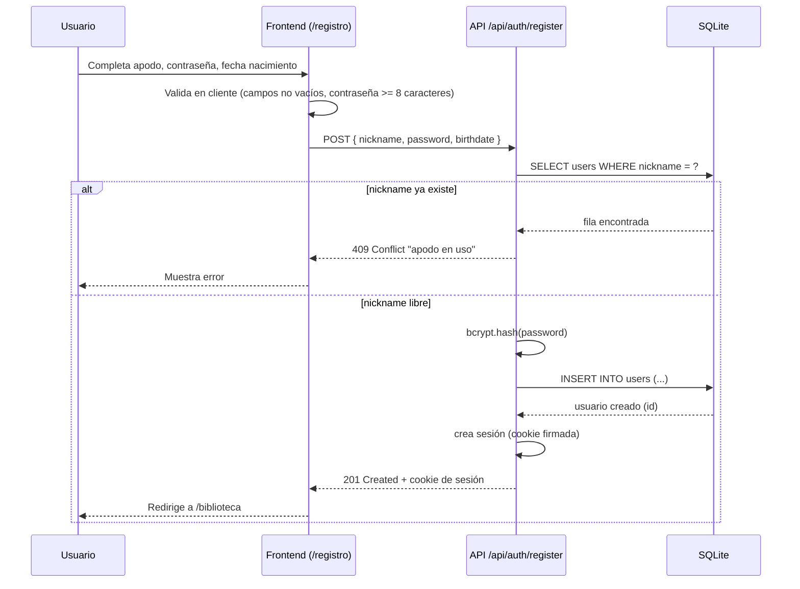
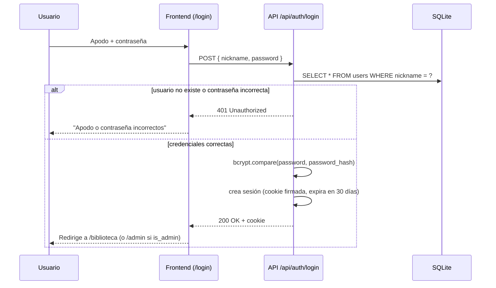
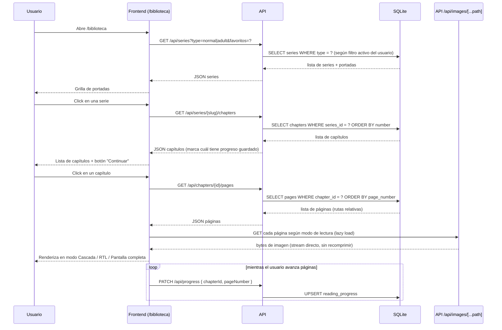
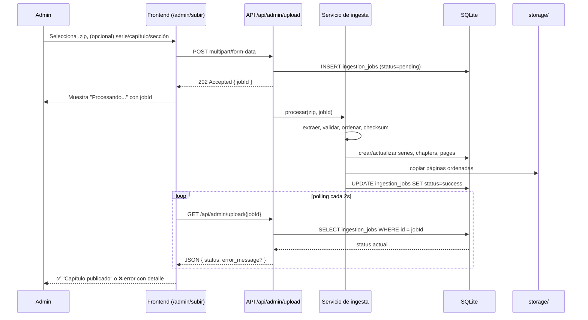

# 5. Flujos de usuario

## 5.0 Visitante (sin cuenta) y pestañas de la biblioteca

Al entrar a la página **no se fuerza el login**: la raíz redirige a
`/biblioteca` y se ve el menú normal. En el menú aparecen los botones
**"Iniciar sesión"** y **"Registrarse"** para quien no tenga cuenta.

| Pestaña | Qué muestra | Visitante | Usuario logueado |
|---|---|---|---|
| **Todo** | Solo **Noticias** (anuncios del admin, cosas por venir). Nunca mangas. | ✅ (más invitación a registrarse) | ✅ |
| **Normal** | Catálogo de series de la sección Normal + fila "Continuar leyendo" de esa sección | ✅ (sin "Continuar leyendo") | ✅ |
| **+18** | Catálogo +18 + su fila "Continuar leyendo" | ❌ (no se muestra) | Solo si `show_adult_content` está activado |
| **★ Favoritos** | Series marcadas con ★ por el usuario | ❌ (pestaña oculta) | ✅ |

El visitante puede abrir la ficha de una serie y ver sus capítulos, pero al
intentar **leer** (`/leer/...`) el middleware lo manda a `/login` — ese es el
momento natural de registrarse. El progreso y los favoritos requieren cuenta.

## 5.1 Registro

Apodo + contraseña + fecha de nacimiento (con selector tipo calendario).
Como la app es privada, la fecha de nacimiento se usa solo como dato
personal/preferencia (por ejemplo, para eventualmente saludar tu
cumpleaños o precargar el filtro `show_adult_content`), **no** como
control de acceso legal.

## 5.2 Login

## 5.3 Navegar la biblioteca y leer

## 5.4 Subida de capítulo (admin)

## 5.5 Diferencia Dashboard (admin) vs Biblioteca (lector)

| | Dashboard (`is_admin = true`) | Biblioteca (cualquier usuario) |
|---|---|---|
| Ruta base | `/admin` | `/biblioteca` |
| Subir capítulos | ✅ | ❌ |
| Crear/editar series | ✅ | ❌ |
| Publicar/editar/borrar noticias | ✅ (`/admin/noticias`) | ❌ (solo las lee en "Todo") |
| Ver historial de ingestas | ✅ | ❌ |
| Gestionar usuarios (crear cuentas de confianza) | ✅ | ❌ |
| Leer, marcar favoritos, progreso | ✅ (también puede leer) | ✅ |
| Filtro Normal / +18 | ✅ | ✅ (según `show_adult_content`) |

## 5.6 Perfil del usuario

En `/perfil` cada usuario puede:

- **Foto de perfil** estilo red social: subir una imagen (se recorta a
  cuadrado 256×256 webp con sharp) o quitarla. Se muestra en el menú superior
  junto al apodo.
- **Cambiar contraseña**: contraseña actual + nueva (mínimo 8 caracteres) +
  repetición.
- **Preferencias**: mostrar contenido +18 (filtro de biblioteca) y modo de
  lectura preferido (cascada/RTL). El modo también se actualiza solo al
  cambiarlo dentro del lector.
