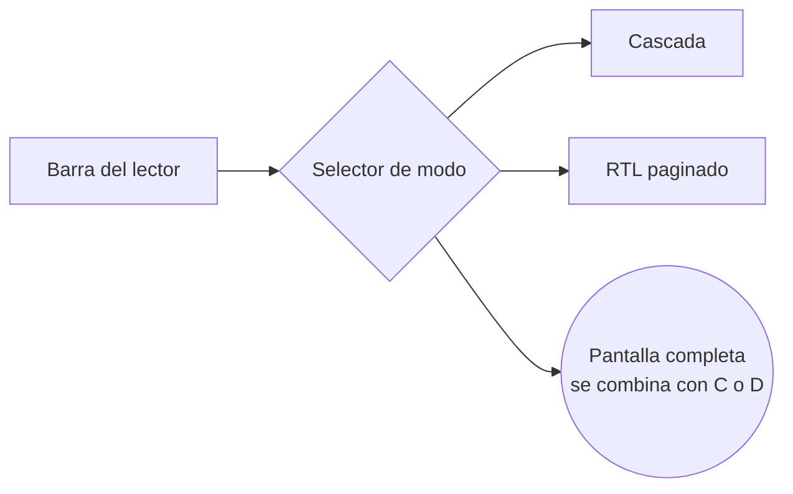

# 6. Modos de lectura (UX)

> El lector (`/leer/[chapterId]`) requiere sesión iniciada: los visitantes
> que intentan leer son redirigidos a `/login`.

## 6.1 Selector de modo

Botón visible en la barra superior del lector, y también recordado como
preferencia (`users.preferred_reading_mode`) para no tener que elegirlo
cada vez.

## 6.2 Modo Cascada (webtoon)

- Scroll vertical continuo: todas las páginas del capítulo apiladas.
- Carga perezosa (lazy load): solo se piden al servidor las imágenes
  cercanas al viewport (`IntersectionObserver`), evita bajar 80 páginas de
  golpe.
- Precarga las siguientes 2-3 páginas mientras el usuario lee, para que no
  haya "salto" al hacer scroll.
- Al llegar al final del capítulo: botón "Siguiente capítulo" o vuelve
  automático a la lista según preferencia.
- Indicador de progreso lateral (barra fina) mostrando en qué % del
  capítulo está.

**Ideal para**: manhwa/manhua (formato vertical nativo).

## 6.3 Modo RTL paginado (manga tradicional)

- Una página a la vez (o spread de dos páginas en pantallas anchas,
  configurable).
- Navegación invertida respecto a cómic occidental:
  - Click/tap en la **mitad derecha** de la pantalla → página **siguiente**.
  - Click/tap en la **mitad izquierda** → página **anterior**.
  - Flecha izquierda del teclado → siguiente · Flecha derecha → anterior
    (invertido a propósito, como un manga físico).
- Contador "página 12 / 34" visible.
- Transición instantánea (sin animación que sume latencia percibida).

**Ideal para**: manga y doujinshi japonés (formato página a página, orden
de lectura derecha→izquierda).

## 6.4 Pantalla completa

- Usa la Fullscreen API del navegador.
- Oculta toda la UI de navegación (header, sidebar) dejando solo la imagen.
- Tap/click en el centro de la pantalla revela controles por 2-3 segundos
  y luego se ocultan de nuevo.
- Combinable con cualquiera de los dos modos anteriores.
- `Esc` o botón flotante para salir.

## 6.5 Comparativa rápida

| | Cascada | RTL paginado |
|---|---|---|
| Dirección | Vertical continua | Horizontal, derecha→izquierda |
| Mejor para | Manhwa/manhua | Manga/doujinshi japonés |
| Carga de imágenes | Lazy load progresivo | Precarga página actual + siguiente |
| Navegación | Scroll | Click/tap zonas + teclado |
| Sensación | Lectura tipo "feed" | Lectura tipo "libro físico" |

## 6.6 Consideración de calidad de imagen

Ningún modo de lectura recomprime ni redimensiona la imagen original en
el servidor. El `` se sirve a resolución nativa; el único
redimensionado es visual (CSS `max-width: 100%`) para que se acomode a la
pantalla — el archivo que llega al navegador es exactamente el que subiste
en el `.zip`.
